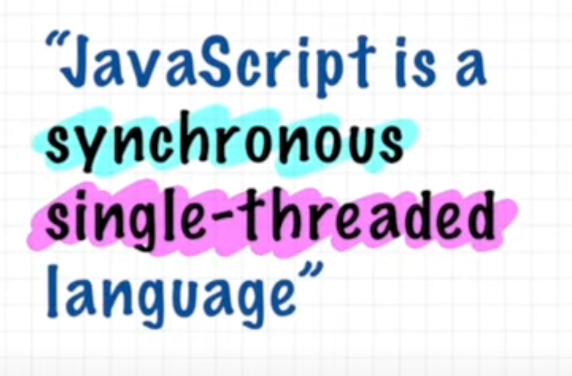

## How JavaScript Works 🔥& Execution Context

- **Everything in Javascript, happens inside an <mark>Execution Context</mark>**
  - 
- Execution Context is like big box or container
- Execution Context has 2 major components

  - **<mark>Memory</mark>** - where all JS variables, functions stored as key, value pair and used to call as **<mark>Variable Environment</mark>**
  - **<mark>Code</mark>** - all code executed in code component, executed line by line, one line at a time, calling as **<mark>Thread of Execution</mark>**
    

- JS is **<mark>Single Threaded</mark>**, since JS executed one command at a time only once with **<mark>Synchronously</mark>** (orderly from top one by one)
  
