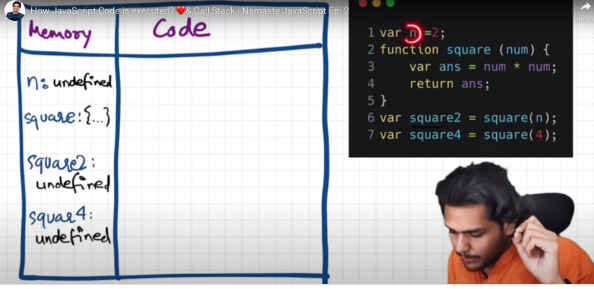
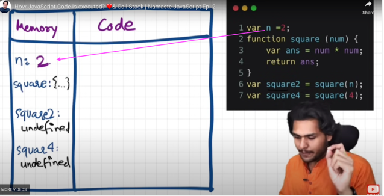
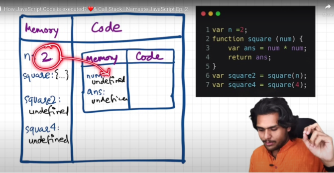
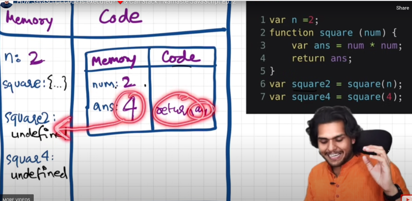
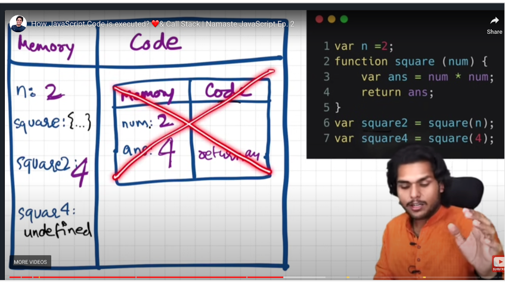
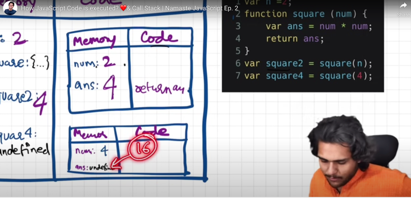
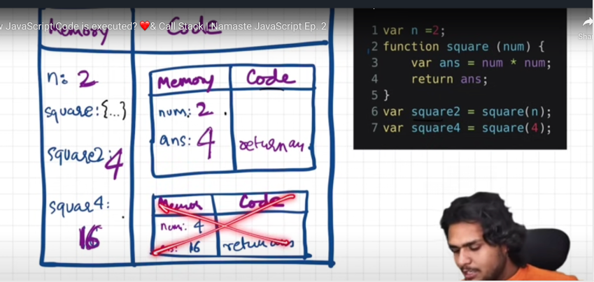
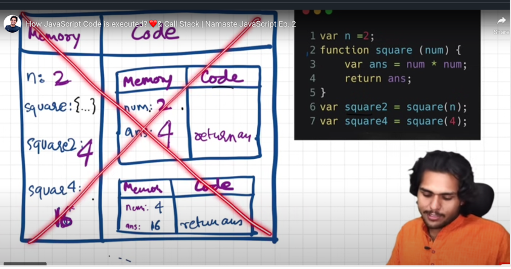

## How JavaScript Code is executed? ❤️& Call Stack

- **What happens when you run the JS code** ?

  - **<mark>Global Execution Context will create with 2 phases</mark>**
    - **<mark>Phase 1 - Memory creation phase, will allocate memory for all JS variables & functions</mark>**
    - **<mark>Phase 2 - Code execution phase, all computation & variable initialization will take care</mark>**

- What happens when run below the piece of JS code ?

  ```javascript
  var n = 2;
  function square(num) {
    var ans = num * num;
    return ans;
  }
  var square2 = square(n);
  var square4 = square(4);
  console.log("square2", square2);
  console.log("square4", square4);
  ```

  - **<mark>Initially Global Execution Context will create</mark>** and start allocating memory for all JS variables & functions
    during Memory creation phase 1

    - **<mark>Initially for all variables assign with undefined, undefined is special keyword which initially during memory creation phase assign to JS variable</mark>**
    - For functions, takes value as a whole function as it is

    
    

  - **During Code execution phase 2, actual calculation will take care** - When control encounters, For variables, start initialize the value in memory by replacing the undefined

    

  - **<mark>Line #6, have a function invocation / calling / executed</mark>**
    - **<mark>Functions are heart of Javascript, act as mini program & behave differently compare to other programming language</mark>**
    - **<mark>When invoke / call the function, brand new Execution Context will create within global execution context and follow the same Memory creation phase & Code execution phase</mark>**
    - 
    - 
  - **<mark>As soon as function completed its execution, its execution context will be removed / deleted & give the control back from where the function is called</mark>**

    - 
    - Similarly in line#7 also will executed with brand new execution context & follow the same process

      - 
      - 

  - **<mark>When whole JS code done with work / executed completely, global execution context will be removed</mark>**
    - 
