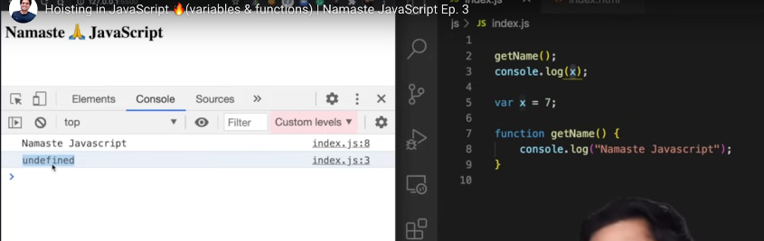
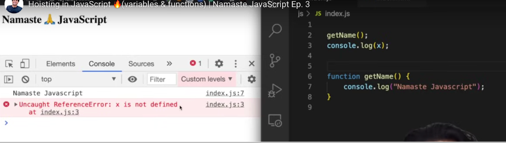
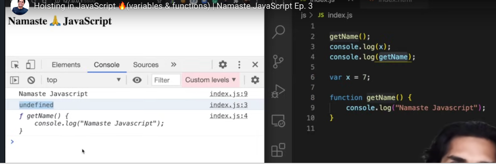

## Hoisting in JavaScript 🔥(variables & functions)

> Answer in Memory creation phase & Code execution phase

- What happens when run below the piece of JS code ?

  ```javascript
  getName();
  console.log(x);

  var x = 7;

  function getName() {
    console.log("Welcome to JS");
  }
  ```

- Magic of JS hoisting

  - 
  - 
  - 

- Is it **<mark>undefined</mark>** and **<mark>not defined</mark>** both are same ?

  - Ans: NO, Both are different

- **<mark>JS Hoisting is behavior where accessing all JS variables & function even before initialized it, without any error</mark>**
- Even before code starts executing, memory is allocating to all JS variables & function during memory creation phase
