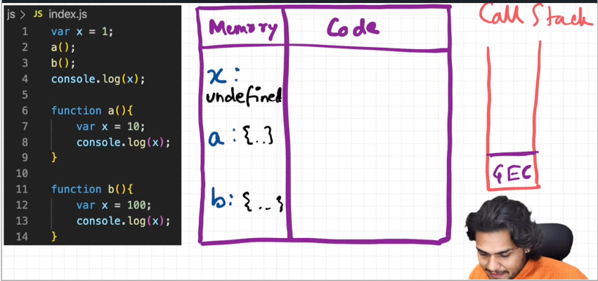
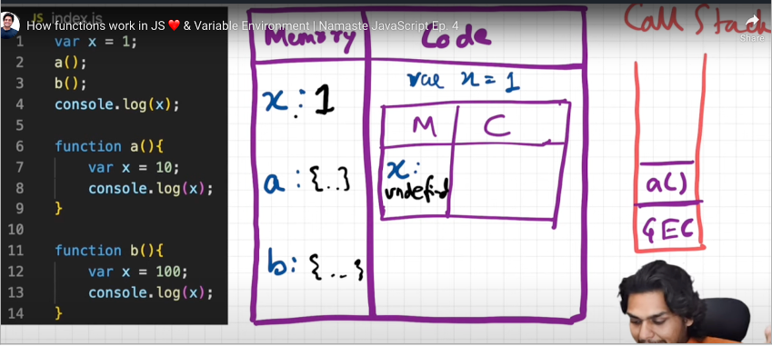
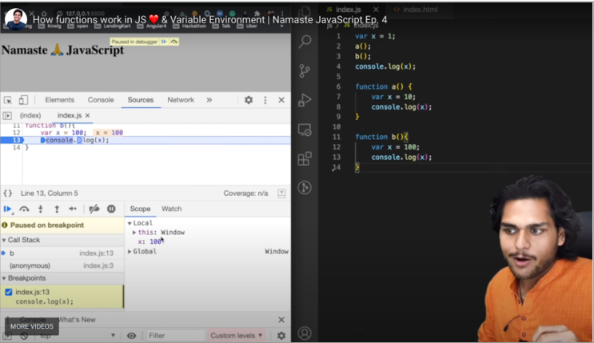

## How functions work in JS ❤️ & Variable Environment

- **<mark>Functions are heart of javascript, act as mini program</mark>**

- Global Execution context & functions

  - 
  - 

- **<mark>While executing Each function has its own / separate memory space, which is independent</mark>**

- By executing JS code, will understand

  - Call stack, where is the controls with line number
  - Separate memory space for function (local, global memory)
  - Memory creation & Code execution phase for Execution contexts
  - 
