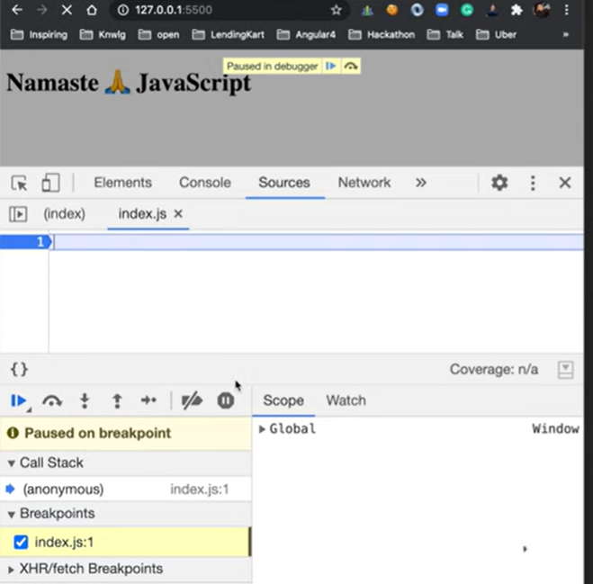
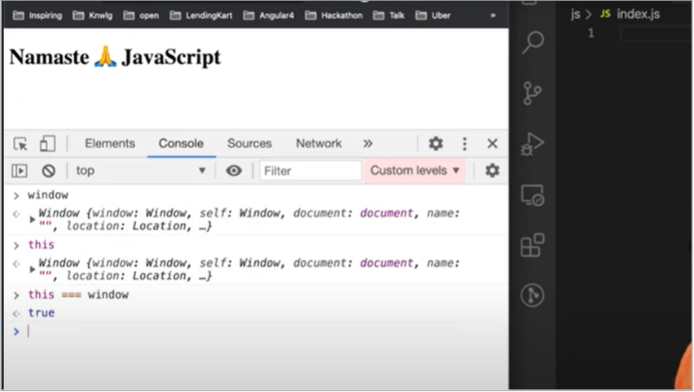
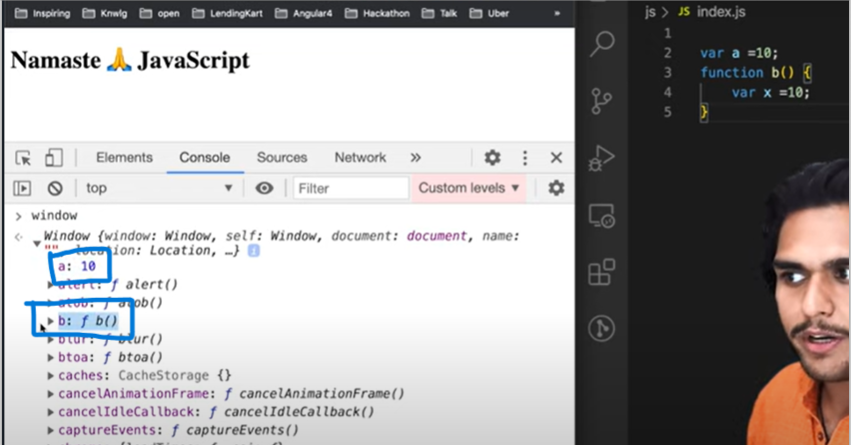
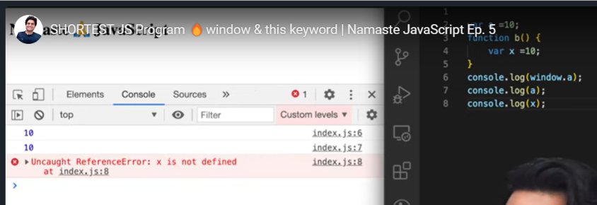
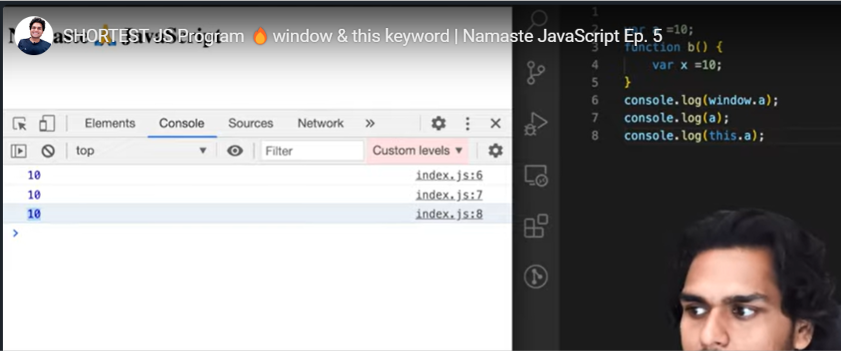
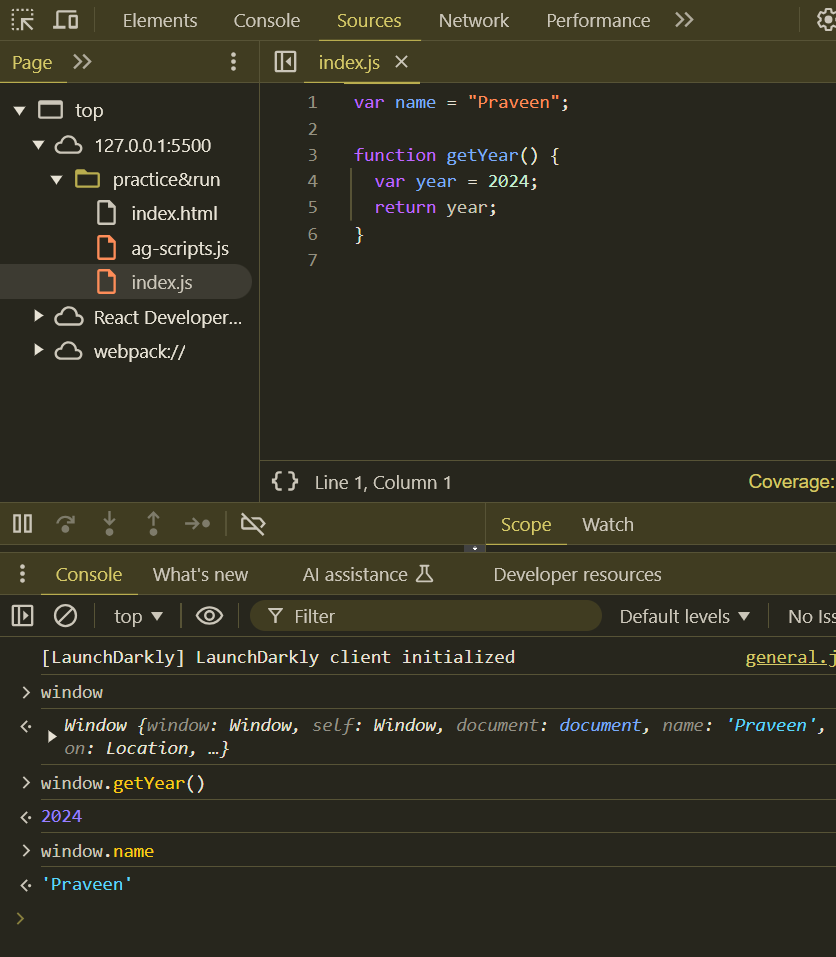

## SHORTEST JS Program 🔥window & this keyword

- Shortest JS program is empty JS file

- What happens when run Empty JS file in the browser

  - Still Global Execution context will create & global memory spaces
  - 

- JS engine will create global **window** object and **this**

- **<mark>window & this is global objects which created along with Global Execution Context when you run any JS code</mark>**

- All JS engines have responsibility to creates the window global object

- In global level, window is equals to this

  - ```javascript
    window === this; // returns true
    ```
  - 

- Whenever global execution context created, along with window & this will create and even for function execution context this will create

- **<mark>Global Space</mark>**

  - **<mark>Any things (variable, functions) which is not inside the any functions is Global spaces</mark>**
  - ```javascript
    var name = "pravn27";
    var age = 33;

    function getName() {
      var year = 2024;
      return year;
    }
    // In above code, variable name, age & function getName are in Global space
    // variable year inside getName function, which is not global space, its local space
    ```

- All variables & function which is in Global spaces, are attached to global window / this object
  - 
  - 
  - 
  - 
