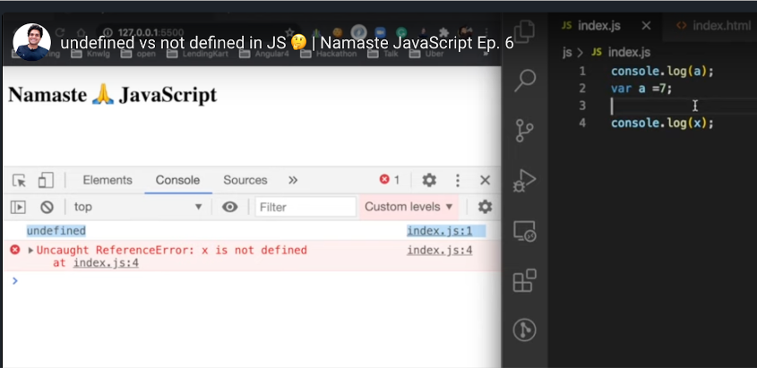
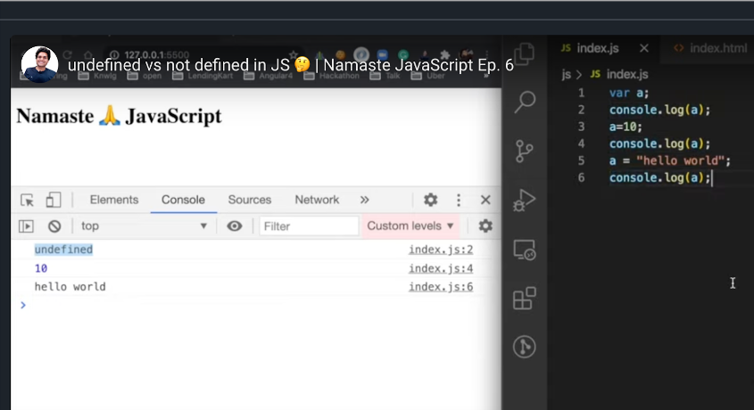

## undefined vs not defined in JS 🤔

- Undefined is very special keyword in JS language

- Undefined comes into picture during memory allocation phase, before starts executing the code

  - 

  - **<mark>undefined is like placeholder placed in the memory</mark>** during JS variables memory allocation, until assign some values to JS variables

- **<mark>undefined is completely different from not defined</mark>**

  - **not defined** will get which is not allocated memory
  - 

- JS is loosely typed / weakly typed language, since JS does not attach its variable to any specific data types. JS is very flexible to changes its data types for variable, calling dynamically typed language

  - 

- Never do the mistake by assigning “undefined” to variable, not a good practice
  ```javascript
  var a = undefined;
  ```
